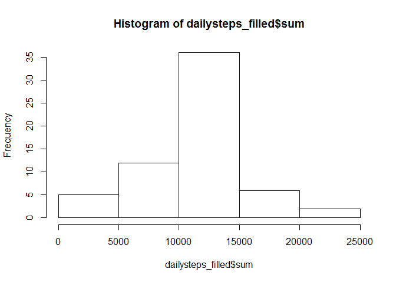
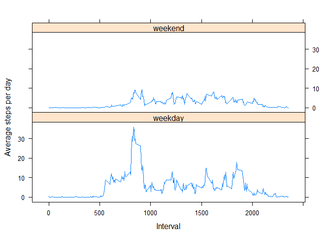

# Reproducible Research: Peer Assessment 1


The goal of this assignment is to analyze data collected from a wearable fitness device; both finding averages and finding daily patterns in the data.

## Loading and preprocessing the data

First, load the data, give it a name, and look at its structure.


```r
data <- read.csv(unzip("activity.zip","activity.csv"))
str(data)
```

```
## 'data.frame':	17568 obs. of  3 variables:
##  $ steps   : int  NA NA NA NA NA NA NA NA NA NA ...
##  $ date    : Factor w/ 61 levels "2012-10-01","2012-10-02",..: 1 1 1 1 1 1 1 1 1 1 ...
##  $ interval: int  0 5 10 15 20 25 30 35 40 45 ...
```

Here, 'steps' is the number of steps taken in a 5 minute interval; 'date' is the date of the observation in YYYY-MM-DD format; 'interval' is the 5 minute interval of the observation in hmm format.


## What is mean total number of steps taken per day?

We need to first group the observations by date, so let's start by converting to a data table


```r
library(data.table)
dt <- data.table(data)
```

First, we find the total number of steps taken each day


```r
dailysteps <- dt[,list(sum=sum(steps,na.rm=TRUE)),by=date]
```

Next, let's verify that every day has either a complete set of 288 observations, or no observations.


```r
dailyobs <- dt[,list(comp=sum(is.na(steps))),by=date]
unique(dailyobs$comp)
```

```
## [1] 288   0
```

Since every day with observations has a complete set of observations, our mean won't be skewed by partial data. Before taking the mean, we should remove the dates which have no observations.


```r
completeobs <- dailysteps[dailysteps$sum!=0,]
mean(completeobs$sum)
```

```
## [1] 10766.19
```


## What is the average daily activity pattern?

Next we will consider the average activity by 5-minute interval. 


```r
stepsByInt <- dt[,list(sum=sum(steps,na.rm=TRUE)),by=interval]
```

We want an average per day, so let's see how many days have recorded observations.


```r
numDays <- sum(dailysteps$sum!=0)
```

Dividing the total number of steps in each interval by 'numDays' will give the average.


```r
plot(stepsByInt$interval,stepsByInt$sum/numDays,type="l",xlab="Interval",ylab="Average steps per day")
```

 

We would also like to find the interval with the highest average -- since every interval has an equal number of observations, this is the same as the highest total sum.


```r
maxTime <- which.max(stepsByInt$sum)
stepsByInt$interval[maxTime]
```

```
## [1] 835
```

The most steps were taken during the 5-minute interval beginning at 8:35 am.
## Imputing missing values

Let's find how many observations are missing from the data.


```r
sum(is.na(dt))
```

```
## [1] 2304
```

We will now fill in the values which are missing -- if an observation for a particular interval on a particular day is 'NA', we will replace it with the mean observation for that particular interval over all days.


```r
intList <- unique(dt$interval)
for(i in intList)
  dt$steps <- replace(dt$steps,which(is.na(dt$steps) & dt$interval==i),mean(dt$steps[dt$interval==i],na.rm=TRUE));
head(dt$steps,20)
```

```
##  [1] 1.7169811 0.3396226 0.1320755 0.1509434 0.0754717 2.0943396 0.5283019
##  [8] 0.8679245 0.0000000 1.4716981 0.3018868 0.1320755 0.3207547 0.6792453
## [15] 0.1509434 0.3396226 0.0000000 1.1132075 1.8301887 0.1698113
```


```r
dailysteps_filled <- dt[,list(sum=sum(steps,na.rm=TRUE)),by=date]
hist(dailysteps_filled$sum)
```

 

We can verify that, since we have replaced missing values by the mean values, the mean of daily steps is the same with either data set.


```r
c(mean(dailysteps_filled$sum),mean(completeobs$sum))
```

```
## [1] 10766.19 10766.19
```

In contrast, each of the days with missing observations were replaced with identical data, so we should not expect the median to be the same -- if there was enough missing data to begin with, we should expect this mean value to be the new median.


```r
c(median(dailysteps_filled$sum),median(completeobs$sum))
```

```
## [1] 10766.19 10765.00
```

Our histogram has an artificially high spike at the mean, since all of our missing days are now represented there.


## Are there differences in activity patterns between weekdays and weekends?

Finally, we will consider whether there are differences which can be detected between the activity on weekdays and weekends. Does the user begin their day later on the weekends? Do they have a regularly scheduled exercise on weekdays but not on weekends? 

Let's first organize the data by date, and then create a new factor variable, which will take the values  'weekday' or 'weekend', to split the data into two groups. 


```r
dt$dayType <- ifelse(weekdays(as.Date(dt$date))=="Saturday" |  weekdays(as.Date(dt$date))=="Sunday","weekend","weekday")
weekday_data <- dt[dt$dayType=="weekday",]
weekend_data <- dt[dt$dayType=="weekend",]
head(weekday_data)
```

```
##        steps       date interval dayType
## 1: 1.7169811 2012-10-01        0 weekday
## 2: 0.3396226 2012-10-01        5 weekday
## 3: 0.1320755 2012-10-01       10 weekday
## 4: 0.1509434 2012-10-01       15 weekday
## 5: 0.0754717 2012-10-01       20 weekday
## 6: 2.0943396 2012-10-01       25 weekday
```

```r
head(weekend_data)
```

```
##    steps       date interval dayType
## 1:     0 2012-10-06        0 weekend
## 2:     0 2012-10-06        5 weekend
## 3:     0 2012-10-06       10 weekend
## 4:     0 2012-10-06       15 weekend
## 5:     0 2012-10-06       20 weekend
## 6:     0 2012-10-06       25 weekend
```

```r
byIntWday <- weekday_data[,list(sum=sum(steps,na.rm=TRUE)),by=interval]
byIntWend <- weekend_data[,list(sum=sum(steps,na.rm=TRUE)),by=interval]
library(lattice)

numWday <- dim(byIntWday)[1]
numWend <- dim(byIntWend)[1]

byIntWday$sum <- byIntWday$sum/numWday
byIntWend$sum <- byIntWend$sum/numWend

byIntWday$dayType <- "weekday"
byIntWend$dayType <- "weekend"

byIntAvg <- rbind(byIntWday,byIntWend)

head(byIntWday)
```

```
##    interval        sum dayType
## 1:        0 0.35174266 weekday
## 2:        5 0.06957547 weekday
## 3:       10 0.02705713 weekday
## 4:       15 0.03092243 weekday
## 5:       20 0.01546122 weekday
## 6:       25 0.24849319 weekday
```

```r
head(byIntAvg)
```

```
##    interval        sum dayType
## 1:        0 0.35174266 weekday
## 2:        5 0.06957547 weekday
## 3:       10 0.02705713 weekday
## 4:       15 0.03092243 weekday
## 5:       20 0.01546122 weekday
## 6:       25 0.24849319 weekday
```

```r
xyplot(byIntAvg$sum ~ byIntAvg$interval | byIntAvg$dayType,layout=c(1,2),type="l",xlab="Interval",ylab="Average steps per day")
```

 


